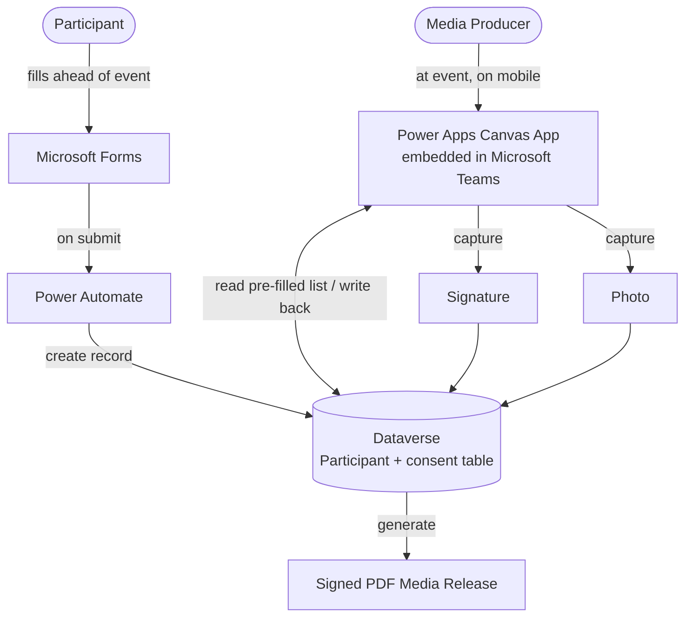

[media-release-app-README.md](https://github.com/user-attachments/files/29278855/media-release-app-README.md)

# Media Release App

> A Power Apps (Teams) solution that digitizes on-site media release consent — pre-filling participant data captured ahead of time, then capturing signature and photo at the event and generating a signed release document, all backed by Dataverse.


---

## 🎯 The Problem

Media events require each participant (reporters, journalists, producers, contributors) to sign a media release granting consent. Done on paper or filled from scratch on the day:

- **On-site data entry is slow** — collecting each person's details at the event creates bottlenecks and queues when many participants need processing at once.
- **Paper releases are hard to manage** — physical signatures and forms are easy to lose, hard to search, and painful to audit later.
- **No reliable link between consent and identity** — matching a signature to the right person, with a photo for verification, was manual and error-prone.
- **Producers needed mobility** — the person managing releases is moving around an event venue, not sitting at a desk.

---

## 💡 The Solution

A two-stage workflow that moves all the slow data collection *before* the event, leaving only the quick, in-person capture for the day itself.

**Stage 1 — Ahead of the event:** participants complete a **Microsoft Form** with their details. A **Power Automate** flow writes each submission into a **Dataverse** table, so the participant list is ready and pre-populated before anyone arrives.

**Stage 2 — At the event:** the Media Producer opens a **Power Apps canvas app embedded in Microsoft Teams** on a mobile device. The app shows the pre-filled participant list, scoped by event code and location. The producer selects a participant, captures their **signature** and **photo** directly on the device, and both are written back to Dataverse against that person's record. A signed **PDF media release document** is generated from the captured data.

### Key Features

- **Pre-event data capture** — Microsoft Forms front-end removes on-site typing, cutting the time to process each participant when the event is live.
- **Event-scoped participant list** — searchable list filtered by event code (e.g. `E-011610`) and location (e.g. *Civic Town Hall, Lucknow*).
- **On-device signature capture** — participants sign directly in the mobile app.
- **On-device photo capture** — a photo is taken through the mobile camera for identity verification, stored against the record.
- **Dataverse as the system of record** — every release links participant details, signature, and photo in one structured table.
- **Signed PDF generation** — a media release document is produced from the captured consent data.

---

## 🏗️ Architecture



---

## 🧰 Tech Stack

| Layer | Technology |
|---|---|
| Pre-event capture | Microsoft Forms |
| Integration | Power Automate (Forms → Dataverse) |
| Frontend / UI | Power Apps Canvas app, embedded in Microsoft Teams (mobile) |
| Data | Dataverse (participant details, signature, photo) |
| Device capture | Mobile signature pad + camera (photo capture) |
| Output | Generated PDF media release document |

---

## 👤 My Role

Sole designer and developer. I:

- Designed the two-stage workflow that shifts data entry to before the event
- Built the Microsoft Form and the Power Automate flow feeding Dataverse
- Modeled the Dataverse table linking participant details, signature, and photo
- Built the Power Apps canvas app and embedded it in Microsoft Teams for mobile use
- Implemented on-device signature and photo capture with write-back to Dataverse
- Set up generation of the signed PDF media release

---

## 📊 Results

> Replace the bracketed figures with your real numbers — quantified outcomes are the most persuasive part of the case study.

- ⏱️ Cut on-site processing time per participant by **[75]%** by pre-filling data before the event
- 📋 Replaced paper releases with a **searchable, auditable digital record**
- 🔗 Linked **signature + photo + identity** in a single verifiable record per participant
- 📱 Gave producers a **mobile-first tool** usable anywhere in the venue
- 👥 Used across **[230] events / [4000] participants**

---

## 📸 Screenshots


*Event-scoped participant list with search and location filter. Selecting a participant opens signature and photo capture.*

> The screenshot uses fictional participant names and a sample event — no real personal data.

---

## 📁 What's in This Repo

```
/src        — exported Power Apps source (unpacked via Power Platform CLI)
/docs        — architecture diagram, screenshots
/flows      — Power Automate flow definition (Forms → Dataverse, sanitized)
/samples    — sample Dataverse schema + dummy participant data
```

> ⚠️ **Before publishing:** remove all real participant names, photos, signatures, event codes, locations, environment URLs, and connection references. Signatures and photos are personal data — never commit real ones.

---

## 🔗 Related

- [Back to my profile](#)
